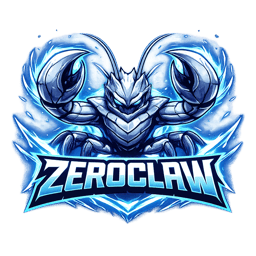
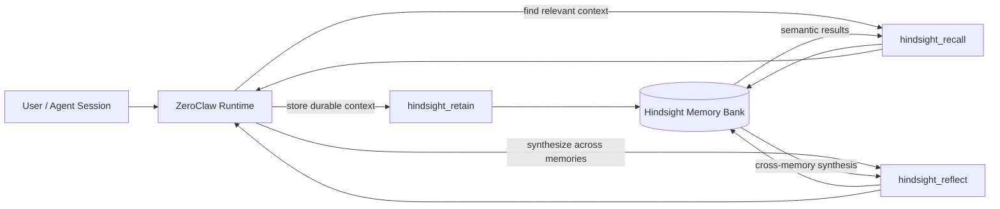

<p align="center">
  
</p>

<h1 align="center">ZeroClaw × Hindsight</h1>

<p align="center">
  <strong>Persistent long-term memory for ZeroClaw agents.</strong><br/>
  Retain facts, recall relevant context, and reason across memories with Hindsight.
</p>

<p align="center">
  <a href="README_CN.md">中文</a>
  ·
  <a href="#quick-start">Quick Start</a>
  ·
  <a href="#architecture">Architecture</a>
  ·
  <a href="https://github.com/zeroclaw-labs/zeroclaw">ZeroClaw</a>
  ·
  <a href="https://github.com/vectorize-io/hindsight">Hindsight</a>
</p>

<p align="center">
  
  
  
</p>

---

## Why this exists

Most agent conversations are still effectively stateless: once a session ends, useful preferences, decisions, and context disappear or have to be re-injected manually.

This repository extends **ZeroClaw** with a Hindsight-backed memory layer so an agent can work with information that survives individual sessions.

The integration intentionally separates three different memory operations:

- **Retain** — write durable facts, preferences, notes, or context.
- **Recall** — retrieve relevant memories with semantic search.
- **Reflect** — synthesize patterns and implications across multiple memories.

That distinction matters: retrieval answers *“what do I remember?”* while reflection can help answer *“what does the accumulated memory imply?”*.

## What this repository adds

| Capability | Tool | What it does |
| --- | --- | --- |
| Durable memory | `hindsight_retain` | Stores a fact, preference, note, or structured context |
| Semantic retrieval | `hindsight_recall` | Searches long-term memory and returns ranked results |
| Cross-memory reasoning | `hindsight_reflect` | Synthesizes an answer across multiple stored memories |
| Search-depth control | `low / mid / high` | Trades latency/cost for retrieval or reasoning depth |
| Memory organization | tags / source / bank | Keeps memories grouped and filterable |
| API compatibility probe | Hindsight version check | Detects supported backend capabilities at runtime |

The implementation lives primarily in `crates/zeroclaw-tools/src/hindsight*.rs`.

## Mental model



The important design choice is that **Hindsight is a memory backend, not a second agent runtime**. ZeroClaw remains responsible for the agent loop and tool execution; Hindsight provides durable memory operations.

## Quick Start

### 1. Prerequisites

- Rust toolchain compatible with this repository
- A Hindsight API endpoint and API key
- A ZeroClaw configuration using the Hindsight memory backend

### 2. Configure memory

Add the following to your ZeroClaw configuration:

```toml
[memory]
backend = "hindsight"

[memory.hindsight]
api_url = "https://api.hindsight.vectorize.io"
api_key = "${HINDSIGHT_API_KEY}"
bank_id = "zeroclaw"
budget = "mid"
timeout_secs = 120
```

Set the API key as an environment variable:

```bash
export HINDSIGHT_API_KEY="your-api-key-here"
```

### 3. Run

```bash
cargo run --release
```

For development:

```bash
cargo check --workspace
cargo test
```

## Tool examples

### Retain

Store a durable preference or decision:

```json
{
  "content": "The user prefers concise weekly project summaries.",
  "context": "Communication preference",
  "tags": ["preference", "communication"]
}
```

### Recall

Retrieve relevant memories:

```json
{
  "query": "How does the user prefer project updates?",
  "budget": "mid",
  "limit": 5,
  "tags": ["communication"]
}
```

### Reflect

Reason across multiple memories:

```json
{
  "query": "What recurring priorities can be inferred from the user's project decisions?",
  "budget": "high"
}
```

## Configuration

The runtime configuration currently supports:

| Field | Default | Purpose |
| --- | --- | --- |
| `api_url` | Hindsight cloud API | Backend endpoint |
| `api_key` | `HINDSIGHT_API_KEY` | Authentication |
| `bank_id` | `zeroclaw` | Memory bank identifier |
| `budget` | `mid` | Default recall / reflect depth |
| `timeout_secs` | `120` | Request timeout |
| `retain_tags` | `[]` | Tags attached to retained memories |
| `retain_source` | unset | Optional source label |
| `retain_user_prefix` | `User` | User transcript prefix |
| `retain_assistant_prefix` | `Assistant` | Assistant transcript prefix |
| `recall_max_tokens` | `4096` | Maximum recall response budget |
| `recall_max_input_chars` | `800` | Maximum recall query length |
| `recall_prompt_preamble` | unset | Optional recall prompt preamble |

> This table mirrors the current code in `HindsightConfig`. If the configuration and documentation ever disagree, the implementation is the source of truth.

## Architecture

```text
ZeroClaw runtime
│
├── agent loop
├── tool registry
│   ├── hindsight_retain
│   ├── hindsight_recall
│   └── hindsight_reflect
│
└── zeroclaw-tools
    ├── hindsight.rs          # shared types
    ├── hindsight_config.rs   # runtime configuration
    ├── hindsight_client.rs   # Hindsight REST client
    ├── hindsight_retain.rs   # durable writes
    ├── hindsight_recall.rs   # semantic retrieval
    └── hindsight_reflect.rs  # cross-memory synthesis
             │
             ▼
       Hindsight API
       ├── memories
       ├── recall
       └── reflect
```

### Data flow

1. ZeroClaw decides a memory operation is useful.
2. The corresponding tool validates and normalizes the request.
3. `HindsightClient` sends the request to the configured memory bank.
4. Hindsight stores, retrieves, or synthesizes memory.
5. The tool returns structured text back into the ZeroClaw agent loop.

## Design principles

**Persistent, not magical.** Memory should be explicit and inspectable rather than an invisible side effect.

**Retrieval and reasoning are different.** `recall` returns relevant evidence; `reflect` performs synthesis across memories.

**Keep the agent runtime separate from the memory service.** This keeps the integration easier to understand, replace, and test.

**Configuration should stay honest.** The README documents only options that exist in the current codebase.

## Status

This repository is an integration project built on top of the ZeroClaw codebase. It is useful for exploring persistent agent memory, but it should be treated as an engineering project rather than a claim that long-term memory is “solved.”

Areas worth improving next:

- integration tests against a reproducible Hindsight test environment
- observable memory traces for retain / recall / reflect calls
- benchmark scenarios for memory precision, recall, latency, and cost
- clearer policies for what should or should not be retained
- migration and failure-handling documentation

## Upstream & attribution

This repository extends **[ZeroClaw](https://github.com/zeroclaw-labs/zeroclaw)** and integrates **[Hindsight](https://github.com/vectorize-io/hindsight)** as a long-term memory service.

The goal of this repository is to make that integration explicit and easy to inspect. ZeroClaw and Hindsight are independent upstream projects; this repository does not imply affiliation with either project beyond using and extending their published software.

## License

Apache-2.0. See [LICENSE](LICENSE).

---

<p align="center">
  <sub>Part of my work on AI agents, persistent memory, and reusable knowledge systems.</sub>
</p>
