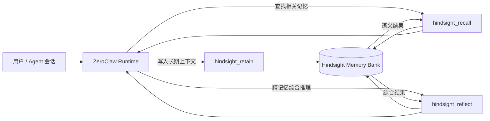

<p align="center">
  
</p>

<h1 align="center">ZeroClaw × Hindsight</h1>

<p align="center">
  <strong>为 ZeroClaw Agent 增加可持久化的长期记忆。</strong><br/>
  让 Agent 能够存储事实、召回上下文，并基于多条记忆进行综合推理。
</p>

<p align="center">
  <a href="README.md">English</a>
  ·
  <a href="#快速开始">快速开始</a>
  ·
  <a href="#架构">架构</a>
  ·
  <a href="https://github.com/zeroclaw-labs/zeroclaw">ZeroClaw</a>
  ·
  <a href="https://github.com/vectorize-io/hindsight">Hindsight</a>
</p>

---

## 为什么做这个项目

很多 Agent 对话本质上仍然是“会话级”的：会话结束后，用户偏好、重要决策和长期上下文要么丢失，要么需要重复注入。

这个仓库在 **ZeroClaw** 上增加 Hindsight 长期记忆集成，让有价值的信息可以跨会话保留。

我刻意把记忆拆成三个不同动作：

- **Retain**：保存值得长期保留的事实、偏好、决定和上下文。
- **Recall**：通过语义检索找回相关记忆。
- **Reflect**：综合多条记忆，提炼模式、关系和推论。

这里最重要的区别是：Recall 更接近“**我记得什么**”，Reflect 更接近“**这些记忆放在一起意味着什么**”。

## 这个仓库增加了什么

| 能力 | 工具 | 作用 |
| --- | --- | --- |
| 持久化记忆 | `hindsight_retain` | 保存事实、偏好、笔记和结构化上下文 |
| 语义召回 | `hindsight_recall` | 按相关性检索长期记忆 |
| 跨记忆推理 | `hindsight_reflect` | 基于多条记忆综合生成答案 |
| 搜索深度控制 | `low / mid / high` | 在速度/成本与检索深度之间权衡 |
| 记忆组织 | tags / source / bank | 对长期记忆进行分组和筛选 |
| API 能力探测 | Hindsight version check | 运行时探测后端能力 |

核心实现主要位于 `crates/zeroclaw-tools/src/hindsight*.rs`。

## 工作方式



核心设计是：**Hindsight 是长期记忆后端，不是第二套 Agent Runtime。** Agent 循环和工具调用仍由 ZeroClaw 负责。

## 快速开始

### 1. 配置长期记忆

```toml
[memory]
backend = "hindsight"

[memory.hindsight]
api_url = "https://api.hindsight.vectorize.io"
api_key = "${HINDSIGHT_API_KEY}"
bank_id = "zeroclaw"
budget = "mid"
timeout_secs = 120
```

设置 API Key：

```bash
export HINDSIGHT_API_KEY="your-api-key-here"
```

### 2. 运行

```bash
cargo run --release
```

开发检查：

```bash
cargo check --workspace
cargo test
```

## 三类工具

### Retain：保存长期信息

```json
{
  "content": "用户偏好简洁的每周项目总结。",
  "context": "沟通偏好",
  "tags": ["preference", "communication"]
}
```

### Recall：找回相关信息

```json
{
  "query": "用户希望项目进展如何汇报？",
  "budget": "mid",
  "limit": 5,
  "tags": ["communication"]
}
```

### Reflect：跨记忆综合

```json
{
  "query": "从用户过去的项目决策中，可以总结出哪些长期优先级？",
  "budget": "high"
}
```

## 当前配置项

| 字段 | 默认值 | 用途 |
| --- | --- | --- |
| `api_url` | Hindsight Cloud API | 后端地址 |
| `api_key` | `HINDSIGHT_API_KEY` | 身份认证 |
| `bank_id` | `zeroclaw` | Memory Bank 标识 |
| `budget` | `mid` | 默认 Recall / Reflect 深度 |
| `timeout_secs` | `120` | 请求超时 |
| `retain_tags` | `[]` | 默认记忆标签 |
| `retain_source` | 未设置 | 可选来源标识 |
| `retain_user_prefix` | `User` | 用户文本前缀 |
| `retain_assistant_prefix` | `Assistant` | 助手文本前缀 |
| `recall_max_tokens` | `4096` | Recall 最大返回预算 |
| `recall_max_input_chars` | `800` | Recall 最大查询长度 |
| `recall_prompt_preamble` | 未设置 | 可选 Recall 提示词前缀 |

> 这里按照当前 `HindsightConfig` 的实际代码整理。文档与实现不一致时，以代码为准。

## 架构

```text
ZeroClaw runtime
│
├── Agent Loop
├── Tool Registry
│   ├── hindsight_retain
│   ├── hindsight_recall
│   └── hindsight_reflect
│
└── zeroclaw-tools
    ├── hindsight.rs
    ├── hindsight_config.rs
    ├── hindsight_client.rs
    ├── hindsight_retain.rs
    ├── hindsight_recall.rs
    └── hindsight_reflect.rs
             │
             ▼
       Hindsight API
       ├── memories
       ├── recall
       └── reflect
```

## 设计原则

**长期记忆应该可解释。** 尽量让写入、召回、推理都能明确区分，而不是变成不可见的“魔法”。

**检索不等于推理。** Recall 提供证据，Reflect 负责跨记忆综合。

**Agent Runtime 与 Memory Backend 解耦。** 这样更容易理解、替换和测试。

**文档必须忠于代码。** README 只描述当前实现确实存在的能力。

## 当前状态与下一步

这是一个建立在 ZeroClaw 代码基础上的长期记忆集成项目，适合用于探索 Agent Memory，但不把“长期记忆”包装成已经解决的问题。

下一步值得继续完善：

- 可复现的 Hindsight 集成测试环境
- retain / recall / reflect 可观测链路
- 记忆准确率、召回率、延迟和成本 Benchmark
- 更清晰的记忆写入策略
- 故障处理和迁移文档

## 上游项目与说明

本仓库扩展自 **[ZeroClaw](https://github.com/zeroclaw-labs/zeroclaw)**，并集成 **[Hindsight](https://github.com/vectorize-io/hindsight)** 作为长期记忆服务。

ZeroClaw 和 Hindsight 均为独立上游项目；本仓库用于研究和实现两者的集成，不代表与上游项目存在额外隶属关系。

## License

Apache-2.0，详见 [LICENSE](LICENSE)。

---

<p align="center">
  <sub>这是我关于 AI Agent、长期记忆与可复用知识系统的一项工程实践。</sub>
</p>
